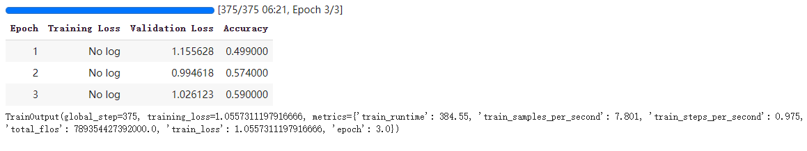

预训练与模型微调
==================

.. note::

    阅读本篇前，请确保已按照 :doc:`安装教程 <./install>` 准备好昇腾环境及 transformers ！

模型获取
-------------

模型获取目前提供三种方式, Meta官方_, Huggingface_, ModelScope_, 其中前两种需要提供信息获取license, ModelScope则可以直接进行下载

Meta官方
<<<<<<<<<<<<<<<<
下载模型前需要获取licence, 前往 `Meta官网 <https://llama.meta.com/llama-downloads>`_ , 提供信息获取到许可证, 拿到已签名的URL

链接类似于下面

.. code-block:: shell 
    :linenos:

    https://download6.llamameta.net/*?Policy=eyJTdGF0ZW1lbnQiOlt7InVuaXF1ZV9oYXNoIjoibGJuYXc0bzdrY2pqNnoxeXZ1N3hmcmNvIiwiUmVzb3VyY2UiOiJodHRwczpcL1wvZG93bmxvYWQ2LmxsYW1hbWV0YS5uZXRcLyoiLCJDb25kaXRpb24iOnsiRGF0ZUxlc3NUaGFuIjp7IkFXUzpFcG9jaFRpbWUiOjE3MTY0MzYyMTF9fX1dfQ__&Signature=KTycLZkPxqMYY0XqW047tNN9IWX%7EOxlQbqCsDqmcX0vE8oia3Qej-x6aGFQSJhkHRULu8Efso5Qde8KRiptK5rGh9oLrtMeAS3SID%7EOyk38o9NNLKxWokA7yQxwvUVRqibVMJyhkE8XEK2HDNftKT9KLaDG8HHFQmGWuhdTJSvCezJIRKWPtzRf0dohepOiOHOcQW%7Ermo7m6iI595PuoX7o3bVYpFYQf1Syrp05XCr9t2-Rzf8xaIYF5-2vFqELFyFyJys%7E5lA4178elcJcUImSSokn1IJBARAZ0iLaWDFsuTbvDJmz9j-ccHFJzgDPCMLQjHpK6QfCk4TWGmdyXMg__&Key-Pair-Id=K15QRJLYKIFSLZ&Download-Request-ID=1502880093958574

之后进行源码的获取， 使用以下命令进行下载并进入到工作目录

.. code-block:: shell 
    :linenos:

    git clone https://github.com/meta-llama/llama3.git
    cd llama3

运行脚本

.. code-block:: python
    :linenos:

    ./download.sh

运行时输入上边获取到的URL, 即可进行模型的下载

Huggingface
<<<<<<<<<<<<<<<
hugging face同样需要获得licence, 访问其中一个仓库, 以 `meta-llama/Meta-Llama-3-8B-Instruct <https://huggingface.co/meta-llama/Meta-Llama-3-8B-Instruct>`_ 为例, 接受许可后等待请求获得批准即可

得到权限后 点击"文件和版本"标签, 下载原始文件夹的内容
或通过以下命令行下载

安装huggingface-hub

.. code-block:: shell

    pip install huggingface-hub

下载文件

.. code-block:: shell

    huggingface-cli download meta-llama/Meta-Llama-3-8B-Instruct --include “original/*” --local-dir meta-llama/Meta-Llama-3-8B-Instruct

ModelScope
<<<<<<<<<<<

ModelScope可以直接进行文件下载, 按照下面方法下载模型

使用命令行安装modelscope

.. code-block:: shell

    pip install modelscope

下载模型

.. code-block:: python 
    :linenos:

    import torch
    from modelscope import snapshot_download, AutoModel, AutoTokenizer
    import os
    
    model_dir = snapshot_download('LLM-Research/Meta-Llama-3-8B-Instruct', cache_dir='/root/autodl-tmp', revision='master')

以上三种方法任意一种即可完成模型的获取, 下面开始预训练以及微调

tokenizer
-----------------
根据规则将文本拆分为标记， 并转换为张量作为模型输入

.. code-block:: python
    :linenos:

    from transformers import AutoTokenizer

    tokenizer = AutoTokenizer.from_pretrained("path/to/model")
    encoded_input = tokenizer("Do not meddle in the affairs of wizards, for they are subtle and quick to anger.")
    print(encoded_input)

输出如下:

.. code-block:: shell

    {'input_ids': [128000, 5519, 539, 1812, 91485, 304, 279, 22747, 315, 89263, 11, 369, 814, 527, 27545, 323, 4062, 311, 19788, 13],
     'attention_mask': [1, 1, 1, 1, 1, 1, 1, 1, 1, 1, 1, 1, 1, 1, 1, 1, 1, 1, 1, 1]}

数据集
----------------

模型训练需要数据集, 这里以 `Yelp Reviews dataset <https://huggingface.co/datasets/Yelp/yelp_review_full>`_ 为例

.. code-block:: python
    :linenos:

    from datasets import load_dataset

    dataset = load_dataset("yelp_review_full")
    dataset["train"][100]

输出如下:

.. code-block:: shell

    {'label': 0, 'text': 'My expectations for McDonalds are t rarely high. But for one to still fail so spectacularly...that takes something special!\\nThe cashier took my friends\'s order, then promptly ignored me. I had to force myself in front of a cashier who opened his register to wait on the person BEHIND me. I waited over five minutes for a gigantic order that included precisely one kid\'s meal. After watching two people who ordered after me be handed their food, I asked where mine was. The manager started yelling at the cashiers for \\"serving off their orders\\" when they didn\'t have their food. But neither cashier was anywhere near those controls, and the manager was the one serving food to customers and clearing the boards.\\nThe manager was rude when giving me my order. She didn\'t make sure that I had everything ON MY RECEIPT, and never even had the decency to apologize that I felt I was getting poor service.\\nI\'ve eaten at various McDonalds restaurants for over 30 years. I\'ve worked at more than one location. I expect bad days, bad moods, and the occasional mistake. But I have yet to have a decent experience at this store. It will remain a place I avoid unless someone in my party needs to avoid illness from low blood sugar. Perhaps I should go back to the racially biased service of Steak n Shake instead!'}

接着使用dataset.map方法对数据集进行预处理

.. code-block:: python
    :linenos:

    def tokenize_function(examples):
        return tokenizer(examples["text"], padding="max_length", truncation=True)

    tokenized_datasets = dataset.map(tokenize_function, batched=True)

初次进行预处理需要一定时间, 内容如下

.. code-block:: shell
    :linenos:

    Asking to pad to max_length but no maximum length is provided and the model has no predefined maximum length. Default to no padding.
    Asking to truncate to max_length but no maximum length is provided and the model has no predefined maximum length. Default to no truncation.
    Map: 100%|████████████████████████████████████████████████████████████████████████| 650000/650000 [03:27<00:00, 3139.47 examples/s]
    Map: 100%|██████████████████████████████████████████████████████████████████████████| 50000/50000 [00:15<00:00, 3156.92 examples/s]

训练
------------

加载模型
<<<<<<<<<

.. code-block:: python
    :linenos:

    from transformers import AutoModelForCausalLM

    model = AutoModelForCausalLM.from_pretrained("path/to/model")

训练超参数及评估
<<<<<<<<<<<<<<<<<<<<<

TrainingArguments类包含可以调整的所有超参数以及用于激活不同训练选项的标志, 这里使用默认训练超参数

.. code-block:: python
    :linenos:

    import numpy as np
    import evaluate
    from transformers import TrainingArguments, Trainer

    metric = evaluate.load("accuracy")

    def compute_metrics(eval_pred):
        logits, labels = eval_pred
        predictions = np.argmax(logits, axis=-1)
        return metric.compute(predictions=predictions, references=labels)

    training_args = TrainingArguments(output_dir="test_trainer", eval_strategy="epoch")

Trainer
<<<<<<<

使用已加载的模型、训练参数、训练和测试数据集以及评估函数创建一个Trainer对象, 并调用train()来微调模型

.. code-block:: python
    :linenos:
    
    trainer = Trainer(
        model=model,
        args=training_args,
        train_dataset=small_train_dataset,
        eval_dataset=small_eval_dataset,
        compute_metrics=compute_metrics,
    )

    trainer.train()

至此, 便可完成简单的模型微调
